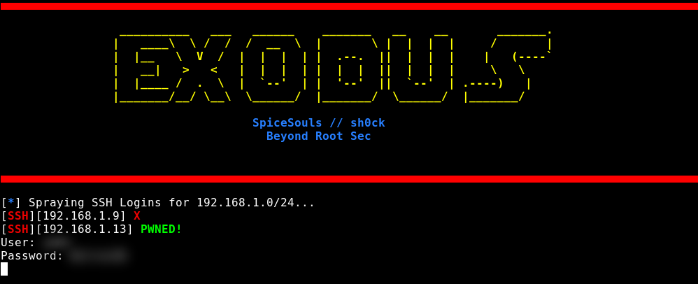

# 🔑 Exodus - Version 1.0.0
#### Fast Network Wide Password Spraying.


[](https://forthebadge.com)
[](https://forthebadge.com)

### ☑️ Currently Supported Protocols

* SMB
* SSH
* FTP

### 📌 To Do

* TELNET
* LDAP
* KERBEOS
* HTTP

### 🛠 Installation

```sh
git clone https://github.com/spicesouls/exodus
cd exodus && pip install -r requirements.txt
chmod +x exodus.py
```

### 📃 Usage

```sh
./exodus.py [ IP / CIDR ] [ PROTOCOL ] -u [ USERNAME ] -p [ PASSWORD ] -t [ THREADS ]
```

My Blog: https://beyondrootsec.wordpress.com

BTC Donations: 1CQvmpRCDasK7YKyjsQTZPUobRygqt86t7

**🚧! THIS IS FOR STRICTLY EDUCATIONAL PURPOSES, I AM NOT RESPONSIBLE FOR YOUR USE OF THIS !🚧**

[License](LICENSE)
